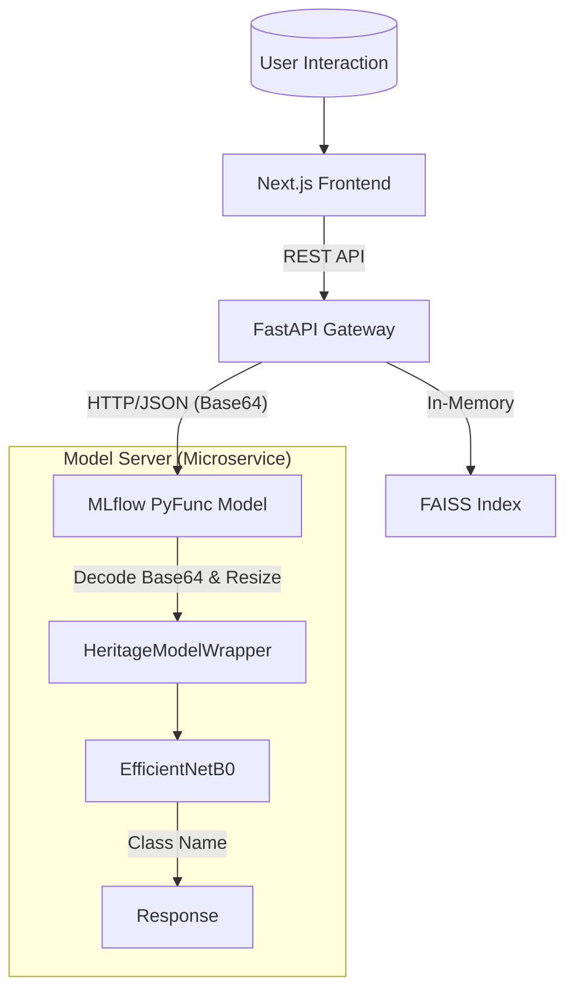

# Scalable AI-Powered Tourism Platform

[](https://www.python.org/)
[](https://tensorflow.org/)
[](https://fastapi.tiangolo.com/)
[](https://mlflow.org/)
[](https://docs.pydantic.dev/)
[](https://nextjs.org/)

## 1. System Overview
This repository houses a **production-grade Machine Learning system** designed for high-throughput heritage classification and personalized tourism recommendations. 

Moved beyond experimental notebooks, this platform uses a **Decoupled Microservices Architecture** to ensure fault isolation and independent scalability of compute-heavy inference workloads.

### Key Capabilities
*   **Computer Vision**: `EfficientNetB0` based classifier for historical structures (Transfer Learning).
*   **Recommender Engine**: Latency-optimized Item-Based Collaborative Filtering using **FAISS** vector search.
*   **Observability**: End-to-end distributed tracing and experiment tracking via **MLflow**.
*   **Resiliency**: Automated Data Quality Gates (TFDV-pattern) preventing training on corrupted datasets.
*   **Zero-Skew Deployment**: Custom `PyFunc` wrappers bundle code, metadata, and weights into self-contained artifacts, eliminating "training-serving skew".
*   **Safe Configuration**: `pydantic-settings` based config management with environment variable overrides.

---

## 🚀 Quick Start (One-Liner)

### 1. Build and Start Services
```bash
make serve
```
*   Builds the **FastAPI** (Python 3.10) backend.
*   Builds the **Next.js** (Node 20) frontend.
*   Starts **MLflow Model Server** (Port 5001).
*   Starts **MLflow UI** (Port 5005).

### 2. Access the Application
*   **Frontend**: [http://localhost:3000](http://localhost:3000)
*   **API Documentation**: [http://localhost:8000/docs](http://localhost:8000/docs)
*   **MLflow UI**: [http://localhost:5005](http://localhost:5005)

## 2. Architecture
The system follows a standard Tiered Architecture pattern, fully orchestrated via `docker-compose`.



### Directory Structure
```
.
├── src/                # Backend Source Code
│   ├── api/            # FastAPI Gateway & Request Validation
│   ├── models/         # Model Definitions (TF & Scikit-learn)
│   ├── pipelines/      # ML Training Orchestration
│   └── data/           # ETL & Data Loaders
├── frontend/           # Next.js 14 Application (React Server Components)
├── mlruns/             # MLflow Artifact Store
├── docs/               # Architecture Decision Records (ADRs)
└── Makefile            # Developer Productivity Tools
```

---

## 3. Developer Guide

### Prerequisites
*   Python 3.10+
*   Node.js 18+
*   Docker (Optional for containerized deployment)

### Setup
We prioritize **Developer Experience (DevX)**. A single command sets up the entire environment.

```bash
make install
```

### Training Pipelines
Pipelines are idempotent and logged automatically.

```bash
# Vision Model (Logs metrics + artifacts to MLflow)
make train-vision

# Recommender System (Includes Pre-training Validation)
make train-recommender
```

### Local Development (Distributed)
The system runs as three independent services locally to mimic production constraints.

**1. Model Inference Service** (Port 5001)
*Hosts the EfficientNet model in a dedicated process.*
```bash
make serve-model
```

**2. API Gateway** (Port 8000)
*Handles business logic, routing, and response formatting.*
```bash
make serve
```

**3. Frontend Experience** (Port 3000)
*Next.js SPA Dashboard.*
```bash
make ui
```

---

## 4. Documentation & References
*   **[Engineering Design Doc](docs/ENGINEERING_WRITEUP.md)**: Detailed breakdown of architectural choices, trade-offs, and scalability analysis.
*   **[Capstone Submission](docs/AIML_CAPSTONE_SUBMISSION.md)**: Project report mapped to specific academic requirements.
*   **API Specification**: `http://localhost:8000/docs` (Swagger/OpenAPI).

---

## 5. License
MIT License. Free for academic and commercial use.

