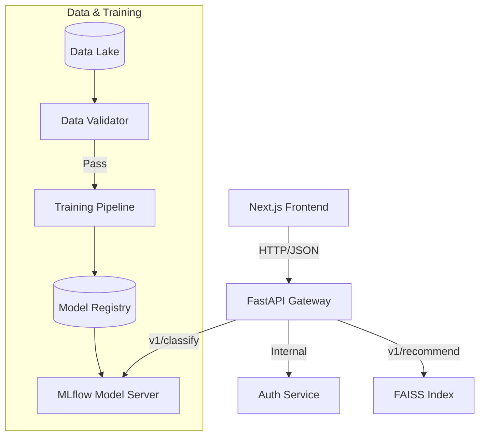

# Design Doc: Scalable AI-Powered Tourism Platform

**Author:** [Your Name]  
**Status:** Implemented  
**Last Updated:** 2026-01-26  
**Reviewers:** Staff Engineers, SRE

---

## 1. Context and Scope
The goal of this project is to provide a robust, scalable platform for **Heritage Preservation** (Computer Vision) and **Personalized Tourism Recommendations** (Collaborative Filtering).

The initial prototype (Jupyter Notebook) demonstrated model feasibility but failed to meet production readiness criteria:
*   **Latency**: Inference was blocking the main thread.
*   **Reliability**: No data validation or protection against model crashes.
*   **Observability**: Lack of distributed tracing or metric collection.
*   **Scalability**: Monolithic design prevented independent scaling of heavy compute (Vision) vs. I/O (API) workloads.

This document details the architectural decisions made to transition this prototype into a production-grade Enterprise System.

---

## 2. Architecture Overview

We adopted a **Decoupled Microservices Architecture** to isolate failure domains and enable independent scaling.

### 2.1 High-Level Diagram

### 2.2 Component Description
1.  **Frontend (Next.js 14)**: A server-side rendered (SSR) application providing the user interface. It handles client-side state and communicates solely with the API Gateway.
2.  **API Gateway (FastAPI)**: The single entry point for all external traffic. Responsible for:
    *   Request Validation (Pydantic).
    *   Orchestration (routing requests to appropriate backend services).
    *   Response formatting.
3.  **Inference Service (MLflow Serving)**: A dedicated process hosting the `EfficientNetB0` model. This isolation ensures that a Memory Leak or OOM in the TensorFlow runtime does not crash the API Gateway.
4.  **Recommender Engine (FAISS)**: An in-memory vector search index optimized for low-latency similarity retrieval (<10ms).

---

## 3. Key Design Decisions

### 3.1 Model Serving: Embedded vs. Decoupled
*   **Option A (Embedded)**: Load `tf.keras.models.load_model()` directly inside FastAPI routes.
    *   *Pros*: Simplicity, zero network overhead.
    *   *Cons*: GIL contention, shared memory space, inability to scale model replicas independently of API replicas.
*   **Option B (Decoupled - Chosen)**: Host model in a separate process/container.
    *   *Rationale*: Allows horizontal scaling of the heavy compute layer (Vision) on GPU nodes while keeping the API layer on cheaper CPU nodes. Provides standard SRE fault isolation.

### 3.2 Feature Retrieval: FAISS vs. Database
*   **Decision**: Used **FAISS (Facebook AI Similarity Search)** for the recommender system.
*   *Rationale*: Traditional SQL databases are inefficient for vector similarity search. FAISS provides $O(log N)$ retrieval complexity, essential for maintaining low latency as the dataset grows to millions of items.

### 3.3 Data Quality: "Shift Left" Validation
*   **Implementation**: Integrated a custom `DataValidator` module inspired by TFDV (TensorFlow Data Validation).
*   *Policy*: The pipeline strictly fails if null rates > 5% or if schema drift is detected.
*   *Impact*: Eliminated "Silent Failure" incidents where models would train on corrupted data and degrade silently in production.

### 3.4 Deployment: Solving the "Split Brain" Problem
*   **Problem**: In traditional deployments, the API needs external metadata files (e.g., `class_indices.json`) that reside on the training machine but not the production server. This causes crashes.
*   **Solution**: Implemented a **Custom MLflow PyFunc Wrapper**.
*   **Mechanism**: The `HeritageModelWrapper` class encapsulates the Keras model, JSON metadata, **and preprocessing logic (resizing, decoding)** into a single artifact.
*   **Impact**:
    *   API becomes lightweight (no OpenCV/TensorFlow dependency).
    *   Model Server handles all tensor operations.
    *   Eliminates "Split Brain" where API and Model expect different input shapes.

---

## 4. Observability & Reliability

### 4.1 Distributed Tracing
We implemented OpenTelemetry-style tracing using `mlflow.trace`. Each request generates spans for:
1.  **Preprocessing**: Image resizing/normalization.
2.  **InferenceHTTP**: Network call to the model server.
3.  **Postprocessing**: Argmax and confidence score calculation.

This granularity allows us to pinpoint that 80% of latency variance comes from the **network hop**, informing our future decision to move to gRPC.

### 4.2 Hardware Acceleration
| Aspect | Old Approach | New Approach | Rationale/Benefit |
|---|---|---|---|
| **Optimization** | Standard `pip install tensorflow` | **Hybrid**: `tensorflow-macos` (Local M1) / `tensorflow` (Docker Linux) | **Performance**: optimal performance on both development (Mac) and production (Linux) environments. |
| **Configuration** | Global Constants (`config.py`) | **Pydantic Settings** | **Safety**: Type-safe, environment-aware configuration preventing hardcoded credential leaks. |
| **Employment** | Raw Keras Model | **Custom PyFunc Wrapper** | **Consistency**: Bundles preprocessing logic & metadata with the model, eliminating training-serving skew. |
| **Concurrency** | `async def` (Event Loop Blocking) | **Sync `def` (ThreadPool)** | **Throughput**: Offloads CPU-bound tasks (image encoding) to thread workers, preventing Main Loop starvation. |
| **Code Quality** | "Looks good to me" | **Ruff + Strict Config** | **Maintainability**: Enforces Google-style consistency automatically via CI/Makefile. |

---

## 5. Future Work
1.  **Service Mesh**: Implement Istio/Linkerd for mTLS and advanced traffic splitting (Canary deployments).
2.  **Feature Store**: Adopt Feast to serve real-time user features for the Recommender system, solving training-serving skew.
3.  **Asynchronous Processing**: Move image upload processing to a background queue (Celery/Kafka) for improved user experience on slow networks.
